# Cinco Dados 🎲🎲🎲🎲🎲

## Contents

1. [SoftwareDevelopmentPlan](#software-development-plan)
    1. [Links](#links)
    2. [Statement of Purpose and Scope](#statement-of-purpose-and-scope)
    3. [List of Features](#list-of-features)
        1. [Cursor Based Navigation and Control](#cursor-based-navigation-and-control)
        2. [Dice](#dice)
        3. [Score Card](#score-card)
        4. [High Score Table](#high-score-table)
        5. [How to Play Screen](#how-to-play-screen)
    4. [User Interaction](#user-interaction)
        1. [General Navigation and User Experience](#general-navigation-and-user-experience)
        2. [Main Menu](#main-menu)
        3. [Game - Dice](#game-dice)
        4. [Game - Score Card](#game-score-card)
        5. [Summary Page / High Score Table](#summary-page-high-score-table)
    5.  [Control Flow Diagram](#control-flow-diagram)
        1. [Main Menu, New Game Setup, and High Scores screens](#main-menu-new-game-setup-and-high-scores-screens)
        2. [Main Game Loop](#main-game-loop)
    6.  [Implementation Plan](#implementation-plan)
    7.  [Help Documentation](#help-documentation)
        1. [Installation](#installation)
        2. [System Requirements](#system-requirements)
        3. [How to Use this Application](#how-to-use-this-application)
            1. [How to Play](#how-to-play)
            2. [High Scores](#high-scores)
            3. [New Game](#new-game)
        4. [Advanced Usage](#advanced-usage)
    5. [Testing](#testing)
        1. [Automatic Testing](#automatic-testing)
            1. [Game Model](#game-model)
            2. [Player](#player)
            3. [Palyer Scores]{#player-scores}
            4. [Text](#text)
        2. [Manual Testing](#manual-testing)
## Software Development Plan
### Links

- [Github repository](https://github.com/leighpoulier/cinco-dados)  
- [Trello board](https://trello.com/b/uHqXtL1J/cinco-dados)  
- [Manual testing spreadsheet](https://docs.google.com/spreadsheets/d/1wJI3GNPPTrftSQKoeWJNgMlS92xe-D9lnzCIf8iFqco/edit?usp=sharing)


### Statement of Purpose and Scope

"Cinco Dados" _(SINK-oh DAH-dohs)_ is Español for "Five Dice".  Five Dice is a game of chance played with ... you guessed it ... five dice.  You probably know it by another name, which is a trademark, so I won't be using that name!  Throughout this text, "dados" is used instead of "dice", but they are the same thing.  Six sided cubes with numbers on the sides.

Cinco Dados is going to be my take on this game and is dedicated to my partner, who is Mexican, and with whom i play it often in real life.  It is aimed at people who would like to take a few minutes of leasure time, and can be played either alone or with friends. The game involves rolling five dados up to 3 times to achieve certain combinations, such as matching or sequentially numbered dados, and strategically inserting those rolls into the available slots on the score card to maximise your score. 

The application is intended to fulfil social and entertainment needs for anyone who enjoys casual games, whether solo or with friends. A single player game provides around 10-15 minutes of fun, and a proportinally longer amount of time for more players as play is passed between players after every turn. The application is intended as a direct substitue for five real dados and a paper score card. It can be used by anyone who may not have access to five real dados, or have a convenient space to roll five dados easily.  It is much easier to play Cinco Dados on a computer when you don't have access to dados or a flat surface, such as while travelling.

A visual representation of the dados on screen simulates real dados on a table top.  A tabular depiction of the score card similar in appearance to a paper score card increases realism and user engagement. The score card provides automatic score calculation based on the rolled dados values, and keeps a running total of these scores for each player, and declares a winner at the end of the game.  How convenient!

Players may like to keep records of their highest ever scores, and the game will keep track of the these in a "High Scores" function.  This function will persistenly save the highest scores even through closing and reopening the application.


### List of Features

#### 1. Cursor Based Navigation and Control

Navigation throughout the application is intended to be accomplished solely with use of the arrow keys to select various on-screen controls, such as buttons.  Once these controls are selected, the space bar or enter key can be used to activate the action that each control represents.  Controls can be simple buttons such as Yes/No/Exit or other controls such as the dados, or the individual table cells on the score card.  Using these controls instead of text input limits the need for input validation and provides a familiar graphical user interface.

#### 2. Dice

During the main game, the five dados are "rolled" to generate the required combinations.  The dados will be represented visually; displayed using a grid of white and black Unicode chacters that can be represented in the terminal.  The values of the dados are generated from five seperate psuedo-random number generators; one for each dados. The action of dados rolling is simulated by animating the dados in a sequence.  A "locking" enables the user to select which dados to roll again and which to keep, simulating adding or removing real dados to a dados cup before rolling.

#### 3. Score Card

While the game is in progress, roughly half of the screen is taken up with the score card.  The table is automatically generated and widens to accomodate the number of players in the current game.  It displays the list of available score categories, and includes a score in those categories that have already had dados rolls allocated.  It calculates and displays the subtotals of the top and bottom secions, applies a bonus for the top section if applicable, and calculates the grand total. There is one column for every player, with their name at the top, which is highlighted when it is their turn. After completing their dados rolls, the player can the cursor to navigate up and down their column to see each prospective score displayed in the available cells, before committing to one.  Only cells which have not yet been allocated are selectable.

#### 4. High Score Table

After completing a game, the score of each player will be assessed to see if it is within the top 10 of all scores ever recorded. If so, the player's name and score will be added to the high score table and the table will be displayed.  The table will be stored persistenly on disk in json format or similar. The high score table can also be viewed at any time by accessing the option from the main menu.

#### 5. How to Play Screen

From the main menu the user can enter a screen of text describing how to play.  This screen contains multiple pages of text which can be navigated with "Next" and "Previous" buttons.


### User Interaction

#### General Navigation and User Experience

Navigation throughout the game menus and main game screen is via a cursor, represented on screen as a square which surrounds a control, and can be moved between available controls. Controls may be graphical items (eg. dados, cells of the scorecard table) or buttons (eg. options in a menu). Different controls may be available depending on game logic at any stage of the application.  Arrow keys are used to navigate the cursor between controls, and once the intended control is surrounded by the cursor, that control will highlight by displaying in a different colour. In some situations the cursor may highlight a control in orange to warn that the consequence of that selection might not be what they player intends.

On most pages in the application a line of context based help text at the bottom of the screen will provide instructions on how to interact with the game at any stage, and will change with the currently displayed screen and curerently selected control. For example in a menu it may display: "Navigate with ←↑↓→  Enter↵/Space to select, Escape to exit".  When the roll button is selected it may say "Leigh's turn. 3 rolls left. Press Enter/Space to roll".

At various times during the game confirmation of a user action is required.  This confirmation is dispayed in Yes/No type modal box overlaid on the current screen.  The user can use the arrow and enter/space to make their selection as above.

#### Main Menu

Initially upon executing the program, the user will be presented with the main menu.  The menu will contain options such as start a new game, view the high scores table, view help information, or quit.  Navigation of the menu options is via the arrow keys up/down/left/right, and pressing the Enter or Space bar to activate the selected option.

Upon selecting to start a new game, the player will be presented with a series of prompts to set up the game.  These prompts will supply the program with the information it needs to run the main game. The information to be entered includes the number of players, and the name of each player.

At the top of each menu page will be a clear heading of the current menu, so that the user maintains awareness of their current position in the menu and what is needed to continue.

From the main menu, the user can also navigate to the "How to Play" screen. On this screen a similar concept is used to navigate through the pages of text, with the "Next" and "Previous" buttons.  Also available from the main menu is the "High Scores" screen, which displays a list of the 10 highest scores ever achieved.

Incorrect input in cursor navigation mode (pressing any non supported key) will be ignored and the visual cursor will not move.  The context help line will continue to display the accepted navigation directions. Incorrect input in a text entry field (on the Player Name screen) will receive a red error message such as "Minimum 5 characters", or "Invalid character".

#### Game - Dice

The theme of arrow key based cursor movement continues during the main game, where the user will move the cursor to command on screen actions to progress the game. The context help line will provide players with context help as above.  

Each turn of the game consists of three rolls; each is activated via a large "ROLL" button which is selected by the cursor. For the first roll no dados are initially displayed, and the context help line will direct users to press enter/space to roll the dados. When the dados are rolled, an animation process will sequentially show the new faces of each dados in sequence. 

Before the 2nd and 3rd roll, any of the dados can be locked so that they will not be affected by subsequent activations of the roll button. The context help line will display context help along the lines of "press the up/down keys to select and enter/space to lock" (or unlock as appropriate). A locked dados will have a visual locking indicator so users can see when they have locked a dados. If all five dados are locked, the roll button will become disabled, preventing the user from rolling no dados and wasting a turn.  Incorrect key presses will be met with the same silent failure, and a lack of cursor movement. Once the intended dados are locked, the player can select and activate the "ROLL" button to continue, or they may choose at any time to allocate their dados roll to the score card.

#### Game - Score Card

Arrow based cursor movement and enter key / space bar command selection continues, maintaining continuity in the user experience.  After the three rolls of a turn are completed, the user will be forced to choose where on the score card to place their final roll.  An algorithm will predict and preselect the best category to allocate the score based on the already allocated scores and the current dados values.

The context help line will display direct the user to navigate up and down the score card to select a score and enter/space to commit the score. The cursor will appear in the player's column of the score card, and the up and down arrows can be used to select available cells of the table.  As each cell is highlighted, it will display the prospective score available should that category be chosen.

Logic will prevent cells already containing a roll from being selected, so when the up/down arrows are pressed the cursor will skip already allocated cells. Cateory selections which would result in zero score will be highlighed in orange when selected.  When the cursor highlights a cell which would result in a non-zero score it will be highlighted green.

To accept the selected category the user can press the space bar or enter key.  If the player selects a zero scoring cell (ie they have no choice, or they are choosing to forego a score for strategic reasons) they will be prompted again with a confirmation message "Are you sure you want enter a zero score for [category]?", and will need to select the yes button and press enter/space again to confirm.

#### Summary Page / High Score Table

After completing a game, some game summary information is displayed, with a ranking of the players and their final scores.  Any player who has achieved a new high score is also indicated.  If the game was single player, the summary information contains the player's final score with a congratulatory message. If the game was multiplayer, then the players will be ranked and the winner declared.

If any player achieved a new high score, the updated high score table is displayed after ending the game, with their new entry highlighted.  No user interaction is expected apart from acknowledgement and closing the page with the enter/space key on the provided button. Again context help will direct the user with a message such as "Press Enter/Space to exit". 

The user can also access the high score table at any time directly from the main menu.

### Control Flow Diagram

#### 1. Main Menu, New Game Setup, and High Scores screens

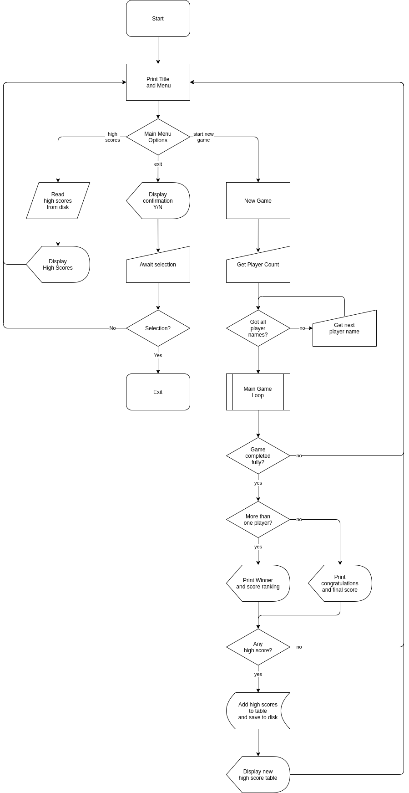

[To view this large diagram correctly at full zoom please click on this link](docs/controlflowdiagram-main.drawio.png)

This diagram shows all parts of control flow, except for inside the main game loop.  The main game loop is represented by a predefined process symbol on this diagram and expanded in a separate diagram below.

#### 2. Main Game Loop

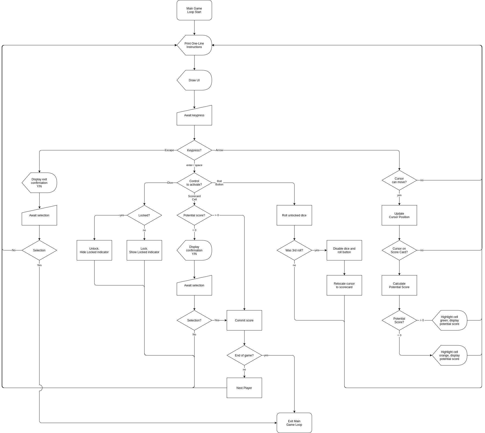

[To view this large diagram correctly at full zoom please click on this link](docs/controlflowdiagram-gameloop.drawio.png)

This diagram shows the control flow once the main game loop is entered, via the previous control flow diagram.

### Implementation Plan

Trello was usedto develop an implementation plan for this project.

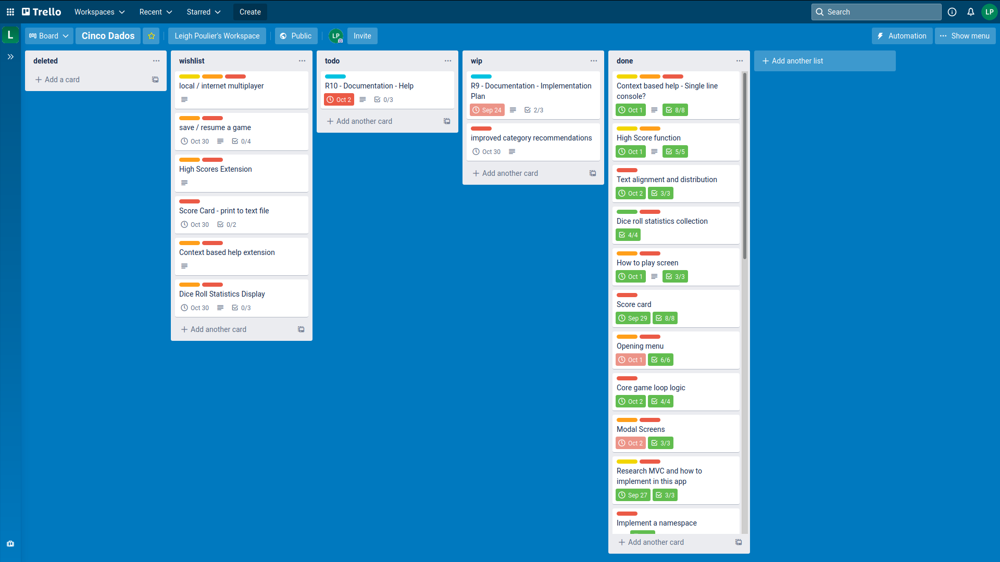

[Please see my Trello Board here: Trello board for Cinco Dados](https://trello.com/b/uHqXtL1J/cinco-dados)

### Help Documentation

This game is called "Cinco Dados", which is spanish for "Five Dice".  Throughout the game and within this user documentation, "dados" is used instead of "dice"

#### 1. Installation

A bash script is provided to install the required dependencies and run the application.  The bash script installs the bundle gem if not already installed, and uses bundle to install all required gems.  Super user permissions may be required depending on where your system wants to store these gems.  You will be prompted for a password should this be necessary.

The required gem dependencies to run this application are:

```
pastel (~> 0.8.0)
tty-cursor (~> 0.7.1)
tty-font (~> 0.5.0)
tty-logger (~> 0.6.0)
tty-prompt (~> 0.23.1)
tty-reader (~> 0.9.0)
```

To install all required dependences, and then run the application execute the following in a terminal

```bash
$ ./cincodados.sh
```

After running this command the first time, the dependencies should all be installed.  On subsequent executions, you can skip the dependency checking and run the application directly by executing the following instead:

```bash
$ ./cincodados-run.sh
```

#### 2. System Requirements

This application relies extensively on unicode characters to draw the user interface.  A terminal emulator capable of displaying 4-byte Unicode characters is required.  Basic colour is used, so any terminal emulator capable of drawing 16 colours should work.

#### 3. How to Use this Application

After starting the application, you will be presented with a main menu screen.  The available options are:

Option|Function
|-|-|
|New Game|Start a new game|
|How to Play|Display a short description of the basics of how to play Cinco Dados|
|High Scores|Display the High Scores table (top 10)
|Exit|Exits the game

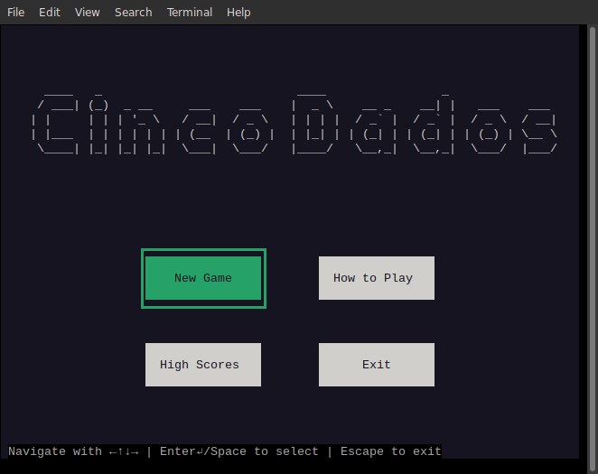

Use the arrow keys to move the cursor, which is displayed as a green box initially surrounding the "New Game" button.  As you move the cursor, the currently selected button will highlight in colour.  Context based help is displayed at the bottom of the screen, showing the available navigation options at any time.

Once you have your intended option selected, press the space bar or the enter (return) key to "press" the button.  The application will then open that function.  You can also press the escape key to exit the application.

##### How to Play

Selecting and pressing enter or space on the "How to Play" button will open a screen with multiple pages of text desribing the basic game play.

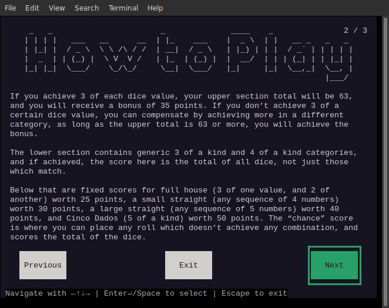

In the image above, w have moved to page 2 of 3, as indicated in the top right. The "Previous" and "Next" buttons are used to page through the text, and the exit button in the centre, or the escape key can be used to return to the main menu.


##### High Scores

The high scores table button will display the top 10 highest scoring players. This information is retained on disk, so your high scoring games are safe.

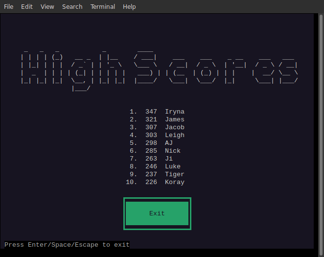

Press enter, space or escape to exit back to the main menu.


##### New Game

After selecting to start a new game, the application asks a few questions to set up the game.  On the first screen, you are asked how many players will be playing.  You can play alone, or with friends at the same keyboard.  

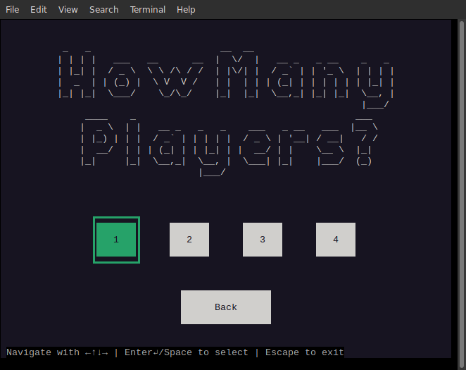

Use the arrow keys to select 1-4 players, and press enter or space to confirm.  A back button is provided to return to the main menu, or the escape key can be used also.

The next screen asks for the players names, one by one.  Enter a name of 1-5 characters and press enter.

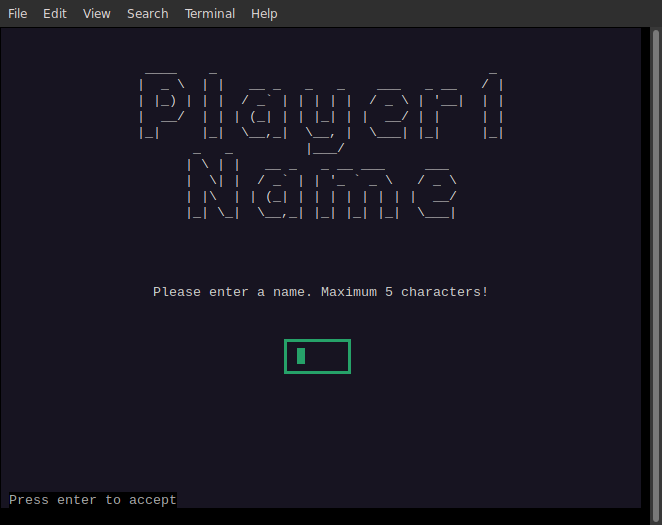

Names outside this range, or containing incompatible characters will case the application to display an error message below the text entry, and ask for the name again.  

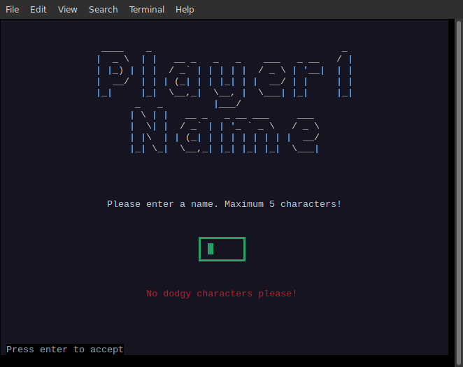

This screen will repeat for each player until all players have entered their names.

After entering names, the main game screen is displayed.  Initially you will see an empty score card on the right of screen, and a green "ROLL" button in the middle.

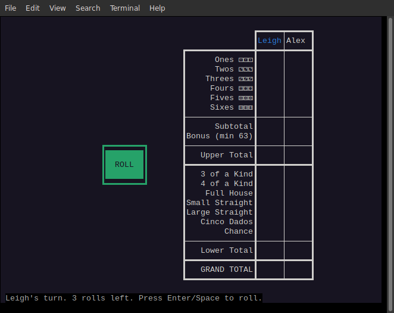

The context based help directs the user to activate the roll button, after which the dados are "rolled" and their faces are displayed on the left of screen.  The first player's name is highlighted in blue, indicating it is their turn, which is also stated at the bottom, along with the number of rolls remaining

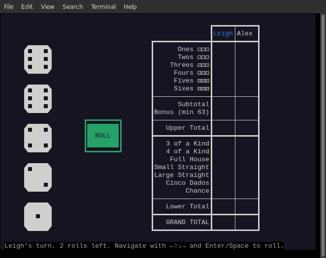

Once the dados have appeared, you may choose to set aside and keep some dados while you continue to roll the others.  Each turn consists of 3 rolls, made up of the initial roll, and two re-rolls.  To keep dados aside, and not roll them again, you must "lock" them.  For example, to lock the 2 sixes, first use the arrow keys to move the cursor onto one of them.


Then press the space bar or the enter key to lock the dado.

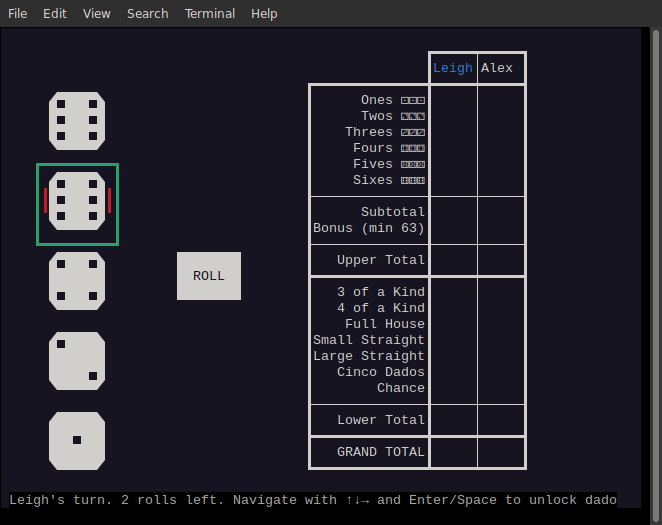

A red indicator appears either side of the dado, indicating that it is locked and will not be included in the next roll.  Let's continue and lock the other six.

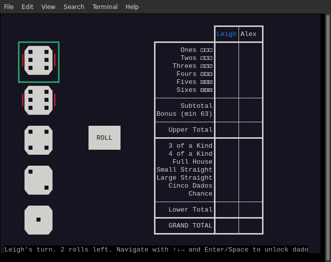

Now we can move the cursor with the arrow keys back to the roll button.  

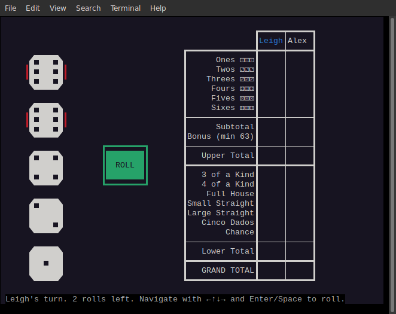

The two sixes are locked and will not be rolled, but the lower three dados will be rolled again.  Press the space bar or enter key to activate the roll button.

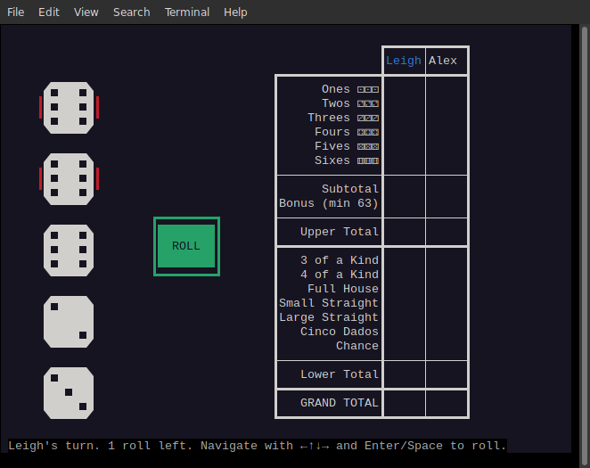

The three lower dados disappear and reapper in sequence to simulate rolling.  We have another six!  Three sixes can be allocated to the "Sixes" category in the upper section, or to the "3 of a kind" category in the lower section.  By moving the cursor to the right, onto the score table, you can see the prospective scores available at any time.  Initially when moving to the score card, the game selects what it thinks is the best score based on the current dados.

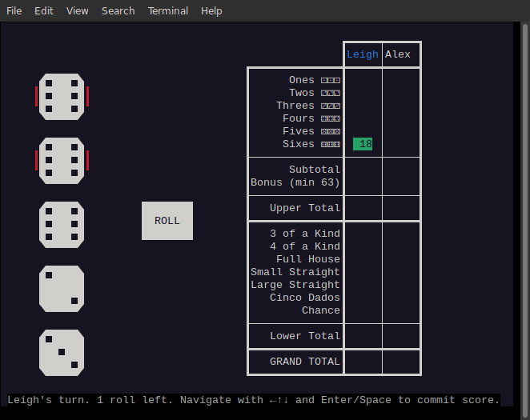

It has preselected the upper sixes category, based on the fact that this gives you a good chance of achieving the upper bonus.  If the enter key or space bar was pressed at this point, it would commit the score and the turn would be over.  However as can be seen at the bottom of screen, we have one more turn left.  Maybe we will get more sixes?  Let's lock the 3rd six and roll again

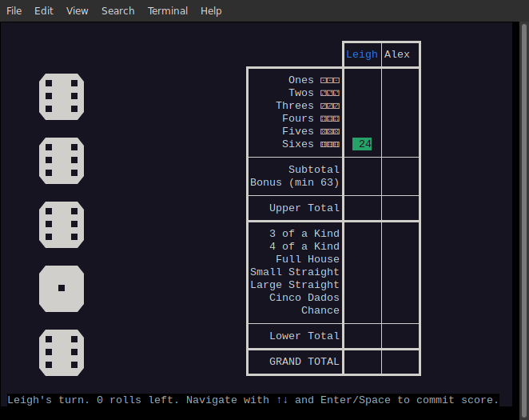

Wow, what are the chances, we have a 4th six.  Notice that the roll button has disappeared.  After rolling the 3rd roll, the cursor will automatically move over to the recommended position on the score card.  We could commit our 24 points to sixes, or we can press the down arrow two times to reposition the cursor on "4 of a kind".  However, notice that if we move further down to the "Full House" cateogory, the cursor displays a score of zero highlighted in orange.  

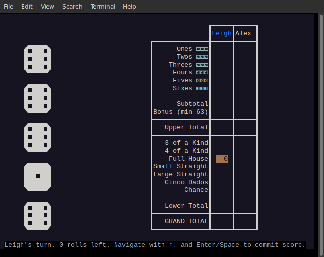

This is because the current dados do not qualify for this category.  If we were to commit the score with "Full House" selected, we would receive zero points. However a confirmation dialogue box will appear asking us to confirm.

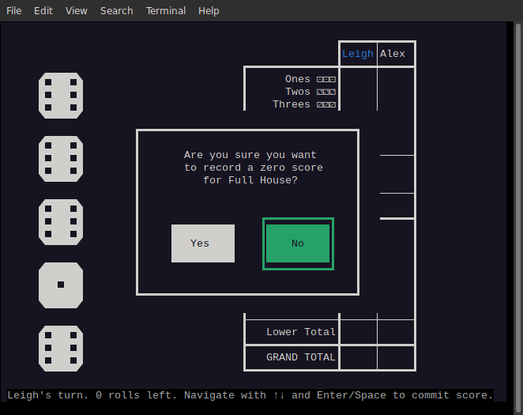

Let's not do that, and return to commiting our 24 points in sixes.

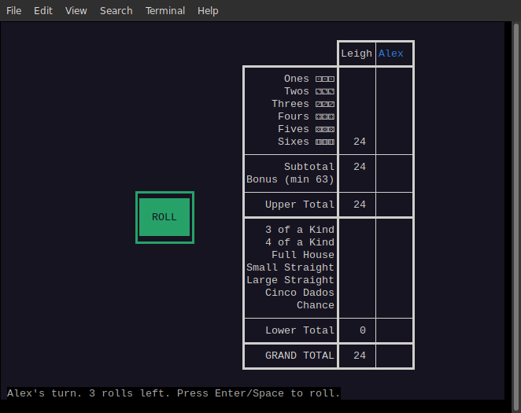

The score is allocated to the sixes category and the totals are updated.  Notice that Alex's name is now highlighted, indicating it is his turn, as is also stated at the bottom.  The dados have disappeared again, ready to be rolled by Alex.

The same sequence repeats for each player, where they roll, choose which dados to keep, and finally choose a spot on the score card to allocate their roll.  There are 13 spaces on the score card, so each player gets 13 rolls. You MUST allocate a roll somewhere on the score card in each turn, so occasionally difficult decisions must be made.

At the end of the game, a summary is displayed and the player with the highest score is declared the winner.

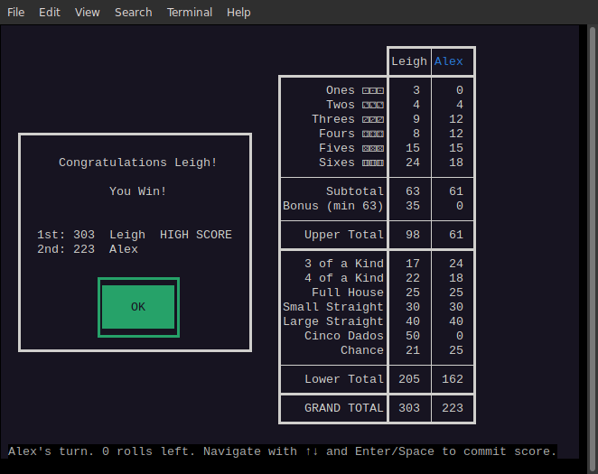

If they have scored high enough to be placed in the high scores a message will appear next to their name.  After pressing enter or space bar on the OK button, the updated high scores table will be displayed with the added player highlighted.

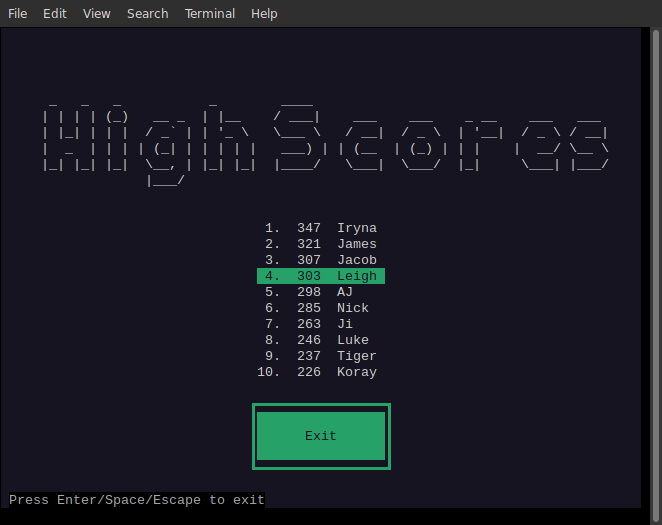

Pressing enter or space will close this high scores screen and return to you to the main menu. 

### Advanced Usage

After the required gem dependencies are installed, the program can also be run by directly starting ruby and passing it the main ruby file.

```bash
$ ruby lib/main.rb
```

Using this method to start the program exposes additional command line options that are available for debugging and testing purposes.

Executing the above command with the `-h` or `--help` flag will display the available options and their usage:

```
    -d, --debug                      enable debug mode with logging to a file
    -s, --static                     disable dice sequenced animation on roll
    -h, --help                       display this usage information
```

`-d` or `--debug` is used to start the program in debug mode, which is useful to develop a graphical program, as it exposes many variable values and can be used to follow the control flow of the program.  A log file will be created in the current directory which contains a huge amount data generated as the program is run.

`-s` or `--static` is used to disable the animation function of the dice rolling, so that they are immediately displayed.  This is also useful for development as there is no waiting for the dice to display each turn.


## Testing

Both rspec based automatic testing and manual testing were used in the development of this appliation

### Automatic testing

Automatic testing was used to test various components of the application

#### Game Model

The game model class is responsible for correctly implementing the rules of Cinco Dados and forms the core of the game.  One of its major functions is to  calculate scores based on the values of the dice.

Automated testing of this function is provided by `spec/game_model_spec.rb`.  Various combinations of 5 dice vales are fed to the appropriate methods and checked for correct detection of the required combinations for various score categories.


#### Player

The player class represents each player in the game.  `spec/player_spec.rb` contains a few tests that check for the correction instantiation of new players.
#### Player Scores

The player scores class is an sub part of the player class and is responsible for managing the players score card.  It calculates the subtotals and applies the upper section bonues if applicable.

Automated testing of the Player Scores class is provided by `spec/player_scores_spec.rb`, and loads a player score card with various values and tests that the score card correctly totals the scores, applies the bonus, and detects a full player card, which is the logic by which the game is ended.

#### Text

The Text class is a static helper class that provides various text manipulation utilites.  It is able to wrap text over multiple lines, or centre text in a line, or distribute multiple lines of text vertically in a space.

These functions are used to position text on the screen in all parts of the application, for example the How to Play paragraphs are automatically wrapped by this class.  The labels on buttons are centred by this class.  Prompts in all modal dialogue boxes are arranged by this class.

The test file `spec/text_spec.rb` contains automated tests which test all this functionality.

### Manual testing

[See Google Sheets Spreadsheet](https://docs.google.com/spreadsheets/d/1wJI3GNPPTrftSQKoeWJNgMlS92xe-D9lnzCIf8iFqco/edit?usp=sharing)

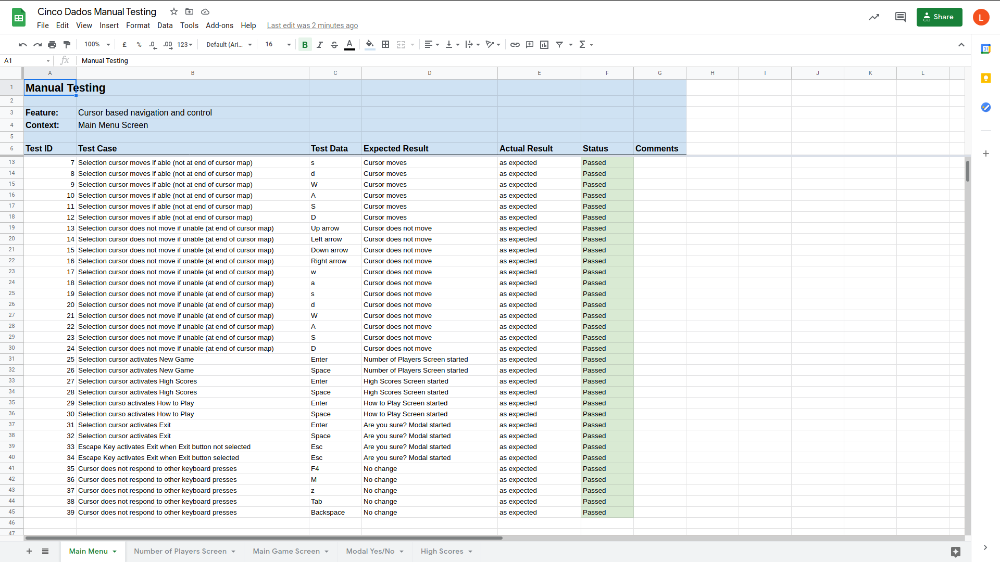

Manual testing was used to test the robustness and functionality of the cursor based navigation implementation. This was not something that could easily be tested with automated tesing.  These tests confirmed that the screens and dialogue boxes respond correctly to expected user inputs, and are not adversely affected by other inputs.

